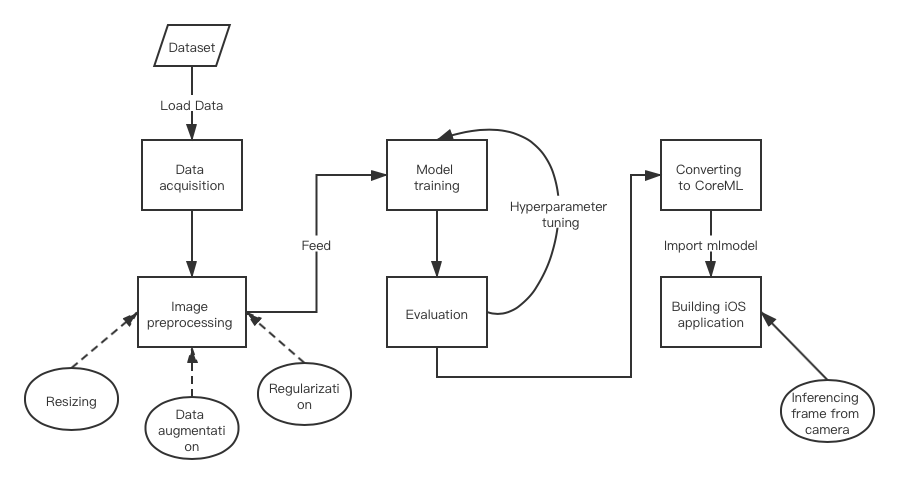
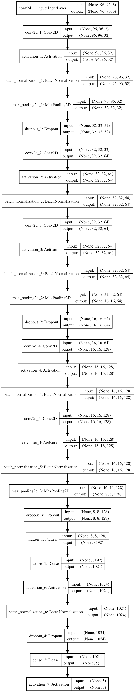
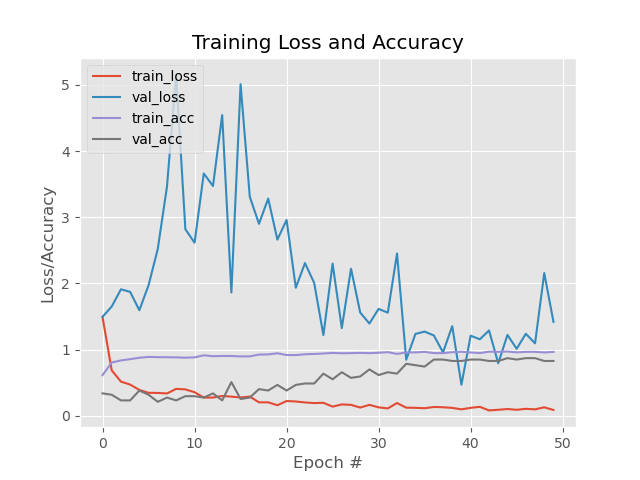

# Pokemon classification on iOS using Convolutional Neural Network based on Keras
Author: Bokun Kong

Link to github repo:

## Introduction
In this study, deep learning models are designed and trained to conduct image classification on live camera stream. I intend to recognize Pokemon by using the neural network on portable iOS devices. Convolutional neural network is trained based on Keras, which converted to CoreML models processed by iOS devices, and live image classification App is built.

The idea is inspired from Pokemon show, the main character always holds a special electronic device called a Pokedex, which provides catalogue and information regarding Pokemon species presumably via camera sensor. The Pokedex acts like a smartphone App utilizing computer vision techniques.

A great number of tutorials about implementing keras CNN for image classification are available online. Many notebooks conducting image classification using Pokemon dataset are provided on Kaggle. I am enlightened by one of the notebook [“Predicting pokemon with CNN and Keras”]( https://www.kaggle.com/trolukovich/predicting-pokemon-with-cnn-and-keras) showing the overall training procedures.

## Research Question
I try to develop an iOS application to conduct live image classification. The application is able to recognize 5 popular Pokemons 'Mewtwo', 'Pikachu', 'Charmander', 'Bulbasaur', and 'Squirtle' trained by Pokemon images downloaded from Kaggle.

## Application Overview
In order to make a CoreML deep learning computer vision application on iPhone, following building blocks are considered in this project: data acquisition, image preprocessing, model training, evaluation, converting to CoreML, building application on iOS. The Flow chart of this project shown at below.

Dataset will be loaded locally, and image preprocessing will be conducted using `ImageDataGenerator`, which also combine data augmentation. Data augmentation benefits deep learning model training as it enlarges training dataset by transforming original images. Then I create model for training with default parameters, and the model utilizes VGG-like architecture. The model performance is evaluated by loss and accuracy on training and validation dataset. Hyperparameters are tuned according to model performance on validation dataset. Various model architectures are compared according to model performance on test dataset. Best model is chosen and converted to CoreML model using `coremltools` in python. Generated `.mlmodel` is CoreML based model making building machine learning mobile App for iOS/iphone more convenient. The model will be imported to Xcode Swift App. I will write Swift code to run live inferences on frames from camera, and then deploy it to iPhone.

## Data
I collect hand-cropped and labeled Pokemon images from Kaggle for Pokemon classification, and there are 149 classes with many images for each. Noticing that this dataset is unbalanced - 9 classes have a lot of pictures (nearly 300), while other classes have few images (nearly 50). Therefore, only 5 classes with most number of images are selected after sorting 'count' for each class. 

After loading images from those five categories, I shuffle the datasets for better training performance, and then all images are resized to (96, 96, 3), since the original images are with various image sizes. Datasets are splitted to train, validation and test daatsets for each category. Data augmentation and image preprocessing are implemented together in `ImageDataGenerator` which provides more efficacy in model training since it preprocesses inputs while model is training. 

## Model
VGG-like architecture is utilized as a base-line model called SmallerVGGNet. This CNN architecture is a smaller, more compact variant of the VGGNet network (Simonyan, Zisserman, 2014)
VGGNet-like architectures are characterized by:
1.	Using only 3×3 convolutional layers stacked on top of each other in increasing depth.
2.	Reducing volume size by max pooling.
3.	Fully-connected layers at the end of the network prior to a softmax classifier. 
`SmallerVGGNet` architecture diagram is illustrated at below:

I have tried other advanced deep learning model using transfer learning such as InceptionV3, and Resnet50. These models are popular image classification architecture with high performance.

## Experiments
The loss and accuracy for train and evaluation dataset are evaluation metrics. For hyperparameter tuning, I will evaluate model performance on validation accuracy. The validation accuracy will be updated at the end of each epoch if `verbose` is 1 during training. Models with various hyperparameters are compared including learning rate, batch size and optimazers. I compare models and list model performances in a table with batch size 32 and 64, learning rate 0.01, 0.05 and 0.001, optimizer “Adam” and “Nadam”. Hyperparameters are updated to the value achieving the best performance of the model. I write scripts to plot the loss/accuracy plot on training and validation set for the model with the best performance on validation dataset.

Various deep learning architectures are trained using transfer learning including `Resnet50` and `InceptionV3`. The performances of those models on test dataset are listed and compared.

The best model is selected and converted to `.mlmodel` with CoreML framework suitable for iOS development. I write Swift code in Xcode to build live camera stream Pokemon classification application using the converted model.

## Results and Observations

For the model with the best performance, I plot loss/accuracy plot on training and validation set. As the training epoch increases, it can be seen that the loss value of the training set or the validation set is reduced generally. As the training epoch grows, it can be seen that the accuracy of the training set or the validation set is increased generally. The huge fluctuation of loss and accuracy indicate that overfitting or underfitting problem are severely existed. Consequently, `EarlyStopping` is implemented, which terminates training if loss increase dramatically. That might because `epoch` is large for current model using this dataset.

Besides, models with various hyperparameters are compared including learning rate, batch size and optimazers. The performances are listed at below. Accordingly, hyperparameters are updated to `batch: 32`, `learning rate: 0.001`, `optimizer: Nadam`. 

| Model | Accuracy | Batch size | Learning rate | optimizer |
| :-----:| :-----: | :-----: | :-----: | :-----: | 
| VGG_Baseline | 80.74% | 64 | 0.01 | Nadam |
| VGG1 | 82.39% | 32 | 0.01 | Nadam |
| VGG2 | 79.82% | 32 | 0.05 | Nadam |
| VGG3 | 80.85% | 32 | 0.001 | Nadam |
| VGG4 | 85.20% | 32 | 0.01 | Nadam |
| VGG5 | 89.74% | 32 | 0.001 | Adam |

Other advanced deep learning models are compared according to performances on test dataset. Therefore, the `SmallerVGGNet` has better performance than `Resnet50` and `InceptionV3` achieving accuracy 87.23% on test dataset. Noticing that other advanced deep learning architecture does not perform well on this dataset, since the dataset is not sufficient for those complex algorithms to train well-performed models, and compact version of VGG architecture might be more suitable for small dataset. 

| Model | Accuracy | 
| :-----: | :-----: | 
| SmallerVGG | 87.23% | 
| Resnet50 | 68.09% | 
| InceptionV3 | 80.85% | 

For the deployment of Pokemon classification on iOS, I develop an iOS application which is able to take live camera stream and classify Pokemon by printing label name and confidence value on the screen. I test the App on iphone 12 pro with iOS 14.1, and I take live camera stream on test images of 5 Pokemon categories. The results shown at below.

## Bibliography
1. Simonyan, K., & Zisserman, A. (2014). Very deep convolutional networks for large-scale image recognition. arXiv preprint arXiv:1409.1556.

## Declaration of Authorship
I, Bokun Kong, confirm that the work presented in this assessment is my own. Where information has been derived from other sources, I confirm that this has been indicated in the work.
Bokun Kong
20/04/2021

